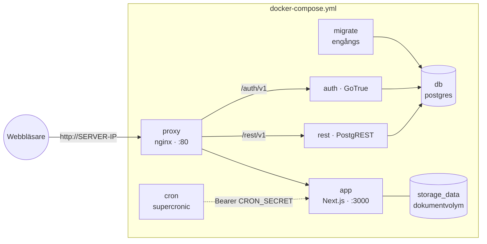

# Självhosta Firmabok

Allt körs på din egen server, på ditt eget nätverk. README:ns
tvåkommandosinstallation är den normala vägen; det här dokumentet är
referensen bakom den.

## Arkitektur

En Compose-fil, [docker-compose.yml](../docker-compose.yml), rymmer
hela stacken:



Designval som är bra att känna till:

- **En adress, ren HTTP.** nginx skickar Supabase-prefixen till rätt
  tjänst och allt annat till appen. Ingen CORS, inga certifikat, inga
  varningar: stacken är byggd för ett privat LAN och appens cookies
  följer adressens schema (`lib/auth/cookie-secure.ts`). Sätter du en
  egen TLS-proxy framför på en https-adress slås Secure-cookies på av
  sig själva.
- **Ingen Kong, ingen studio, ingen pooler, ingen realtime, ingen
  storage-api.** Tjänsterna sköter JWT-verifieringen själva;
  administrera databasen med `psql` genom `docker exec`. Appen frågar
  servern i bakgrunden efter ändringar gjorda utanför den egna fliken
  i stället för att hålla websockets öppna, och dokumentarkivet läses
  och skrivs direkt av appen på volymen `storage_data` — de två
  tyngsta vilotjänsterna i stacken behövdes inte.
- **Migrationerna är en tjänst.** Engångscontainern `migrate` kör nya
  filer ur `supabase/migrations/` vid varje `up`, bokför dem i
  tabellen `_firmabok.migrations`, och appen får inte starta förrän
  den är klar. En uppdatering kan aldrig springa förbi schemat.
- **Namngivna volymer.** Databasen (`db_data`) och dokumentarkivet
  (`storage_data`) ligger under Dockers förvaltning; inget i
  utcheckningen ägs av root.

## Miljövariabler

`install-debian.sh` genererar `.env` vid första installationen.
Variablerna:

| Variabel | Betydelse |
|---|---|
| `DOMAIN` | Serverns LAN-IP (eller ett lokalt DNS-namn) |
| `POSTGRES_PASSWORD` | Databaslösenord för alla tjänsteroller |
| `JWT_SECRET` | HS256-hemlighet som varje tjänst verifierar tokens mot |
| `ANON_KEY` / `SERVICE_ROLE_KEY` | JWT:er i Supabase-stil, signerade med `JWT_SECRET` |
| `CRON_SECRET` | Bearer-token som cron-sidovagnen autentiserar med |
| `AUTH_SIGNUPS_DISABLED` | `true` efter första kontot (`install-debian.sh lock`) |
| `IMAGE_TAG` | Valfri: appens image-tagg, standard `latest` |

## Uppdatera

Kör installationskommandona från README:n igen (eller `git pull` i
utcheckningen och `./install-debian.sh <ip>` på nytt): scriptet hämtar
den nyare app-imagen, kör bara de migrationer som är nya och startar
om. Inget annat behöver skötas.

## Backup

De namngivna volymerna är inte kopierbara — ta backuper logiskt:

```bash
docker exec firmabok-db-1 pg_dump -U postgres -d postgres | gzip > firmabok-$(date +%F).sql.gz
```

Överför den filen till någon lokal lagringsplats, gärna schemalagt. Som ett portabelt,
leverantörsneutralt lager ovanpå: exportera varje räkenskapsår som SIE
via appen (Rapporter → SIE) — vilket svenskt bokföringsprogram som
helst kan läsa in den igen. Dokumenten ligger i volymen
`storage_data`; ta med den om du vill ha kopior på filnivå:

```bash
docker run --rm -v firmabok_storage_data:/data -v "$PWD":/out alpine tar czf /out/firmabok-documents.tgz -C /data .
```

## Bygga från källa

Den publicerade imagen är `ghcr.io/mews-se/firmabok-privat`. För att köra ett
eget bygge i stället:

```bash
docker build -t ghcr.io/mews-se/firmabok-privat:local .
echo 'IMAGE_TAG=local' >> .env
./install-debian.sh <ip>
```

## Felsökning

**Health check går ut.** Titta i loggarna (från utcheckningen):
`docker compose logs migrate app`. De vanliga orsakerna är ett
migrationsfel (migrate slutar med fel och appen startar aldrig) eller
felaktiga värden i `.env`.

**Port 80 är upptagen.** Något annat på servern äger den; stoppa det
eller ändra proxyns portmappning i Compose-filen.

**Inloggningen studsar tillbaka till inloggningssidan.** Appens adress
och adressen i webbläsaren måste stämma överens: `DOMAIN` styr båda.
Kontrollera att du surfar till exakt `http://<DOMAIN>`.

**Registreringen är stängd och jag behöver ett konto till.** Sätt
`AUTH_SIGNUPS_DISABLED=false` i `.env`, kör `docker compose up -d`,
skapa kontot och kör sedan `./install-debian.sh lock` igen.
